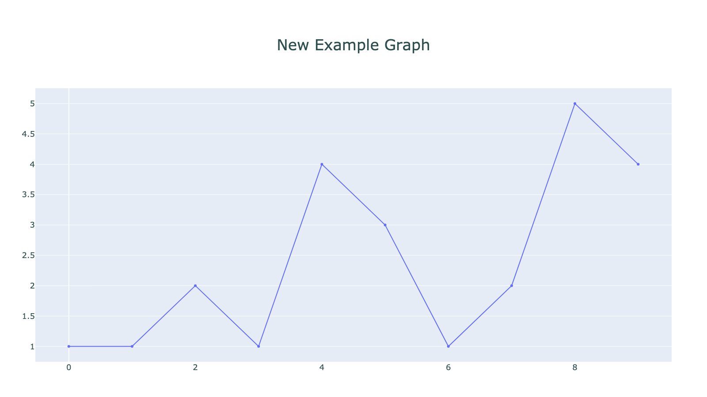

# **plotly-utils**


<div>
    <!-- badges from : https://shields.io/ -->
    <!-- logos available : https://simpleicons.org/ -->
    <a href="https://opensource.org/licenses/MIT">
        
    </a>
    <a href="https://www.python.org/">
        
    </a>
    <a href="https://plotly.com/python/">
        
    </a>
</div>


## *usage*

Some simple patterns/defaults that I like to use alongside Plotly (my chosen graphing library).

Requires plotly (obviously), once installed just import into your code and use, 
mostly alongside the `graph_objects` module.

```python
from random import randint

import plotly.graph_objects as go

from plotly_utils import default_figure, write_and_display


figure = default_figure(
    title="New Example Graph",
    data=go.Scatter(
        x=list(range(10)),
        y=[randint(1, 5) for _ in range(10)],
        mode="lines+markers"
    )
)

write_and_display(
    figure=figure,
    name="example",
)

```




## *installation*

Install directly from GitHub, using pip:

```shell
pip install git+https://github.com/itsluketwist/plotly-utils
```

## *development*

Clone the repository code:

```shell
git clone https://github.com/itsluketwist/plotly-utils.git
```

Once cloned, install the package locally in a virtual environment:

```shell
python -m venv venv

. venv/bin/activate

pip install -e ".[dev]"
```

Install and use pre-commit to ensure code is in a good state:

```shell
pre-commit install

pre-commit autoupdate

pre-commit run --all-files
```
